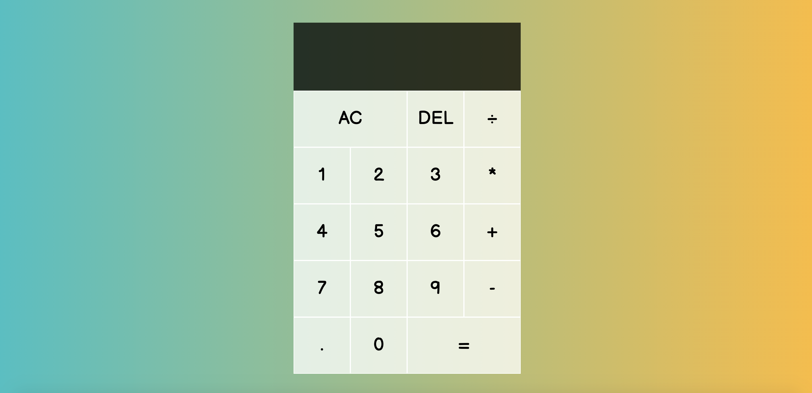

# Javascript Calculator

## Table of Contents
*  [Description](#description)
*  [User Story](#user-story)
*  [Features of the Application](#features-of-the-application)
*  [Preview of the Javascript Calculator](#preview-of-the-javascript-calculator)
*  [Links](#links)
*  [License](#license)
*  [Contributing](#contributing)
*  [Questions](#questions)

## Description

The Javascript Calculator is a simple calculator application that features HTML, CSS, and the use of JavaScript with event listeners, class constructors, and switch cases to bring about its functionality.

## User Story
~~~
AS A user  
I WANT to dynamically compute arithmetic operations  
SO THAT I can solve simple problems.  
~~~

## Features of the Application
~~~
GIVEN a calculator application  
WHEN I click on the numbers, operation symbols, clear, and delete 
THEN I will be able to complete my mathematical computations.  
~~~

## Preview of the Javascript Calculator

The following animation demonstrates the application functionality:

  

To download the above video file of the application functionality, you may do so [here]().

## Links
- [Deployed Application](https://javascript-calculator-app.herokuapp.com/)
- [Github Repository](https://github.com/rh9891/JavascriptQuiz)

## License

This application does not currently have any licenses.

The user is not permitted to use, modify, or share any parts of it. Though the code for this application is hosted on Github, where you are allowed to view and fork the code, this does not imply that the user is permitted to use, modify, or share the contents of this application for any purpose.

## Contributing

If you would like to contribute to this repository, please contact me via [Github](https://github.com/rh9891).

## Questions

If you have any questions, comments, or issues regarding this application, please do not hesitate to contact me via [Github](https://github.com/rh9891).